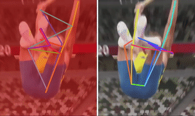

<!-- omit in toc -->
# Improving 2D Human Pose Estimation across Unseen Camera Views with Synthetic Data

The official repository of the RePoGen paper.

<h4 align="center">
  <a href="https://mirapurkrabek.github.io/RePoGen-paper/">Project webpage</a> |
  <a href="https://arxiv.org/abs/2307.06737">ArXiv</a>

  <br/>
  
</h4>

<!-- omit in toc -->
## Table of Contents
- [Description](#description)
- [News](#news)
- [Installation](#installation)
- [Datasets](#datasets)
- [Model](#model)
- [Licence](#licence)
- [Acknowledgements](#acknowledgements)
- [Citation \& Contact](#citation--contact)


## Description

*RePoGen* (RarE POses GENerator) is a method for synthetic data generation using the [SMPL-X](https://github.com/vchoutas/smplx).
*RePoGen* generates humans in very rare poses using the estimation of rotation distribution for each SMPL-X joint. The generated poses are used to augment the COCO dataset to improve performance on extreme views.

## News

-  1 June 2024: Winner of the Best Poster Award on FG 2024
- 5 March 2024: The paper got accepted for 18th IEEE International Conferene on Automatic Face and gesture Recognition (FG 2024)
- 17 July 2023: Code released
- 17 July 2023: Datasets and weights released
- 16 July 2023: The Readme along with description is available. You can read the [paper](https://arxiv.org/abs/2307.06737) and see its [website](https://mirapurkrabek.github.io/RePoGen-paper/). The code is comming soon.

## Installation

The *RePoGen* is installed from the source:
```Shell
git clone https://github.com/MiraPurkrabek/RePoGen
python setup.py install
```
The code requires psbody.mesh library from MPI-IS ([link](https://github.com/MPI-IS/mesh)). For easiest installation, please use [our fork of the repository](https://github.com/MiraPurkrabek/mesh) and install it from source. For more details, see issue https://github.com/MiraPurkrabek/RePoGen/issues/12.

You also have to download the SMPL-X model. See the instructions [here](https://github.com/vchoutas/smplx#downloading-the-model).

Once you install everything right, data are generated by the script [here](./scripts/sample_random_poses.py).

## Datasets

Introduced datasets are available to download on the [project webpage](https://mirapurkrabek.github.io/RePoGen-paper/). The **RePo dataset** was manually annotated while the **RePoGen dataset** was generated by the RePoGen method. We also give you the code in this repository to generate your own synthetic dataset.

## Model

If you are only interested in the pre-trained weights, we release the best model trained on the COCO+RePoGen dataset [here](https://drive.google.com/file/d/1AZ4OwqggPlwZhza7PYukrUeoK0cWwEiD/view?usp=sharing). The weights are for the [ViTPose-s](https://github.com/ViTAE-Transformer/ViTPose) with classic decoder.

## Licence

Please read carefully the [terms and conditions](./LICENSE) and any accompanying documentation before you download and/or use the RePoGen model, data and software, (the "Model & Software"). By downloading and/or using the Model & Software (including downloading, cloning, installing, and any other use of this github repository), you acknowledge that you have read these terms and conditions, understand them, and agree to be bound by them. If you do not agree with these terms and conditions, you must not download and/or use the Model & Software. Any infringement of the terms of this agreement will automatically terminate your rights under this [License](./LICENSE).

Please also note that the RePoGen depends on the [SMPL-X](https://github.com/vchoutas/smplx) which is free to use only for **non-commercial scientific research purposes**. For more, see their homepage.

## Acknowledgements

The code builds on the [SMPL-X](https://github.com/vchoutas/smplx) repository.

For experiments, we used the [COCO dataset](https://cocodataset.org/#home) and the [PoseFES dataset](https://www.tu-chemnitz.de/etit/dst/forschung/comp_vision/datasets/posefes/index.php.en).

## Citation & Contact

The code was implemented by [Miroslav Purkrábek]([htt]https://mirapurkrabek.github.io/).

For questions, please use the Issues of Discussion.

```
@INPROCEEDINGS{purkrabek2024improving,
  author={Purkrabek, Miroslav and Matas, Jiri},
  booktitle={2024 IEEE 18th International Conference on Automatic Face and Gesture Recognition (FG)}, 
  title={Improving 2D Human Pose Estimation in Rare Camera Views with Synthetic Data}, 
  year={2024},
  volume={},
  number={},
  pages={1-9},
  keywords={Space vehicles;Training;Three-dimensional displays;Pose estimation;Gesture recognition;Data models;Orbits},
  doi={10.1109/FG59268.2024.10582011}}
``````
